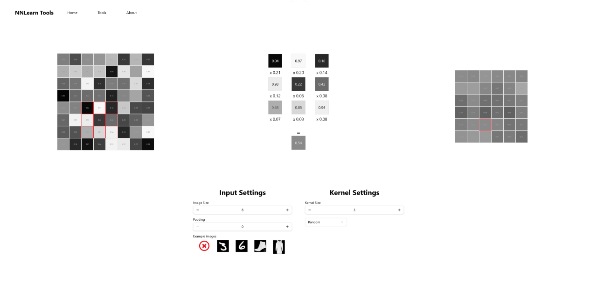

<p align="center">
  
</p>

# NNLearn Tools

NNLearn Tools is a collection of tools for learning various algorithms and methods used in Neural Networks.

> [!WARNING]  
> This project is still in development mode.

## Getting Started

**NNLearn Tools is avaliable at:** [https://nnlearn-tools.vercel.app](https://nn-learn-tools.vercel.app)

### Local Setup

```bash
git clone https://github.com/sv022/NNLearn-Tools.git
cd NNLearn-Tools
pnpm install
pnpm run dev
```

## License

[MIT](./LICENSE) License © 2025 [sv022](https://github.com/sv022)
